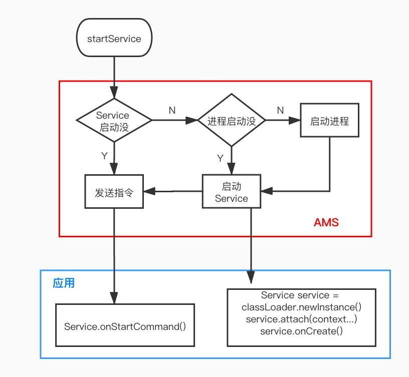

 😎 😨 🤔️ ：好久不见，甚是想念

---

>😎 自认为无所不知，水平已达应用开发天花板，目前月薪 10k

**面试官**：说一说 Service 的启动流程

😎：直接 startService 就启动了鸭

**面试官**：就这样？

😎：你也太小看我了，还有 bindService 啊，也会自动启动

**面试官**： emm，深入点呢？

😎：不好意思，没深入过。。。

**面试官**：没事，回去准备下，下次还问你 Service

---

>😨 业余时间经常打游戏、追剧、熬夜，目前月薪 15k

**面试官**：说一说 Service 的启动流程

😨：Service 作为四大组件之一，当然也是通过 AMS 去管理创建流程的。一个应用进程通过 startService 调用 AMS，然后 AMS 再判断这个 Service 是否已经启动，若未启动则通知应用去启动 Service，或已经启动则直接通知客户端回调 onStartCommand 

**面试官**：这一流程中，你只说了 starService ，用 bindService 会有什么不同吗？

😨：没有吧，只有这一套流程

**面试官**：好的，回去等通知吧

---

>🤔️ 坚持每天学习、不断的提升自己，目前月薪 30k

**面试官**：说一说 Service 的启动流程

🤔️：我来画一下详细的流程图，这样就一目了然了：



**面试官**：怎么判断的 Service 和应用进程是否启动呢？

🤔️：代码走起：

```java
   Context.startService(Intent)
-> ContextImpl.startService(Intent)
-> ContextImpl.startServiceCommon(...)
-> ActivityManager.getService().startService(...)
// AMS: ActivityManagerService
-> AMS.startService(...) 
// ActiveServices: AMS.mServices 
-> ActiveServices.startServiceLocked(...) // 1
-> ActiveServices.startServiceInnerLocked(...)
-> ActiveServices.bringUpServiceLocked(...)  // 2    
```

bringUpServiceLocked 这就是我们要看的方法，但是在讲它之前，我们先看前面的 startServiceLocked 方法

```java
ComponentName startServiceLocked(Intent service, ...) {
    // 根据 Intent 获取 ServiceRecord 对象
    // 每个 Service 在 AMS 都要对应有一个 ServiceRecord 对象
    // 作用如其名 就是用来记录一些 Service 的信息
    ServiceLookupResult res = retrieveServiceLocked(service, ...)
    ServiceRecord r = res.record;
    
    // pendingStarts 后续回调 onStartCommand  
    r.pendingStarts.add(new ServiceRecord.StartItem(r, ...));
    
    return startServiceInnerLocked(smap, service, r, ...);
}
```
讲这个方法主要是为了知道 bringUpServiceLocked 里的 ServiceRecord 是怎么来的，接下来就可以看 bringUpServiceLocked 了

```JAVA
private String bringUpServiceLocked(ServiceRecord r, ...) {
    // r.app 就是表示 Service 所在的进程，真正启动 Service 时会给它赋值
    // Service 已启动的话 这个进程非空，且已经就绪
    if (r.app != null && r.app.thread != null) { 
        // Service 已启动则通过 pendingStarts 触发客户端回调 onStartCommand
        sendServiceArgsLocked(r, execInFg, false);
        return null;
    }
    ...
    // 找到 Service 对就的进程记录
    ProcessRecord app = mAm.getProcessRecordLocked(procName, r.appInfo.uid, false);
    if (app != null && app.thread != null) {
        // 进程就绪才真正去启动 Service
        realStartServiceLocked(r, app, execInFg);
        return null;
    }
      
    // Not running -- get it started, and enqueue this service record
    // to be executed when the app comes up.  
    if (app == null) {
        // 进程没启动则去启动进程
        app=mAm.startProcessLocked(procName, r.appInfo,...)
    }
    if (!mPendingServices.contains(r)) {
        // 记录，进程启动就绪后会再去启动 Service
        mPendingServices.add(r);
    }
}
```
通过以上源码解读可以知道：AMS 是通过其持有 Service 对应的 ServiceRecord 来判断 Service 是否已启动，同时进程是通过类似的 ProcessRecord 来判断是否已启动

**面试官**：通过 bindService 启动的流程会有什么不同吗

🤔️：我们知道通过 bindService 启动时 Service 是不会回调 onStartCommand 的。

来跟一下 bindService 的调用栈，其实和 startService 很类似，这里做一些省略

```JAVA
   ContextImpl.bindServiceCommon(...)
-> ActivityManager.getService().bindService(...)
-> AMS.bindService(...)  
-> ActiveServices.bindServiceLocked(...) 
     
int bindServiceLocked(IApplicationThread caller,...) {
    //  * Flag for {@link #bindService}: automatically create the service as long as the binding exists. 
    if ((flags&Context.BIND_AUTO_CREATE) != 0) { 
        // 这个方法上面已经说过了，会在需要时启动 Service
        bringUpServiceLocked(s,...)
    }
}
```
我们注意到 bindService 最终也是通过 bringUpServiceLocked 去启动 Service，但是调用链中没有调用 startServiceLocked 这个方法，也就没有操作 r.pendingStarts , 自然不会回调 onStartCommand 了。

**面试官**：bindService 还会做一些事，不过我们今天只聊 Service 的启动流程，下次再聊吧。